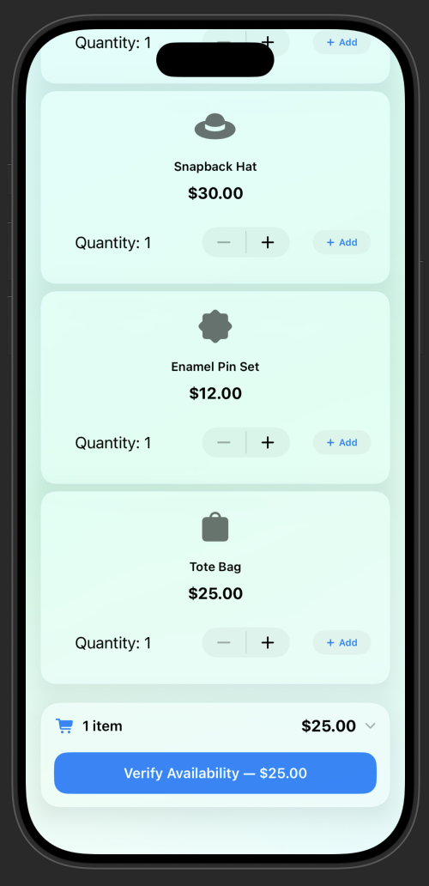
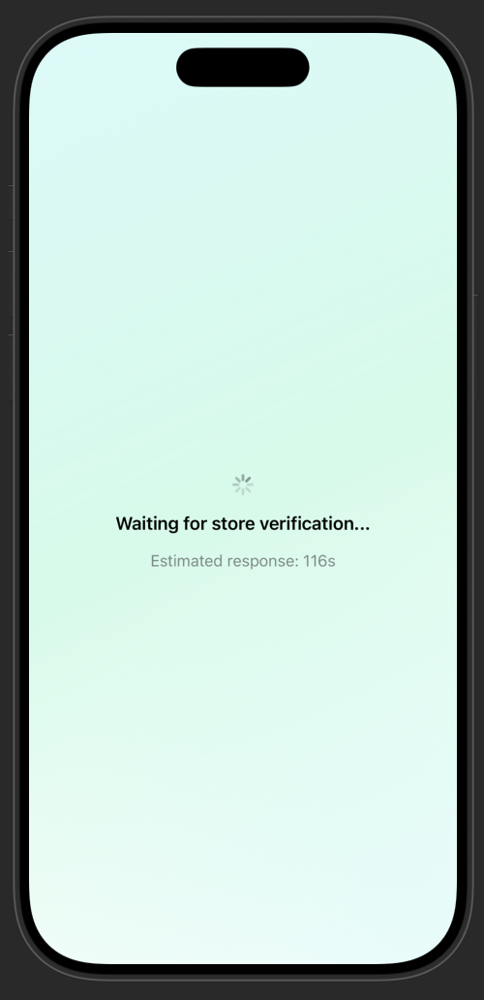
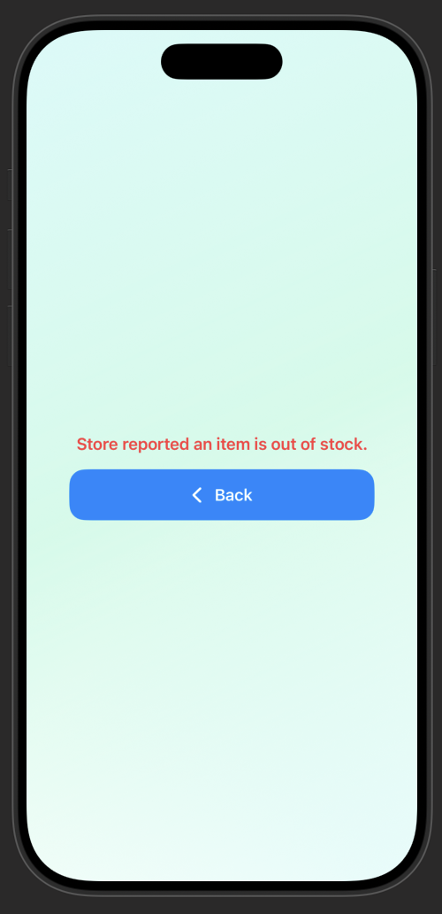
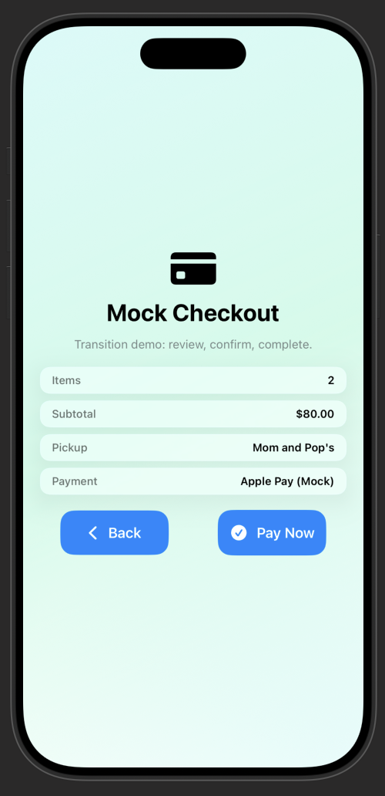
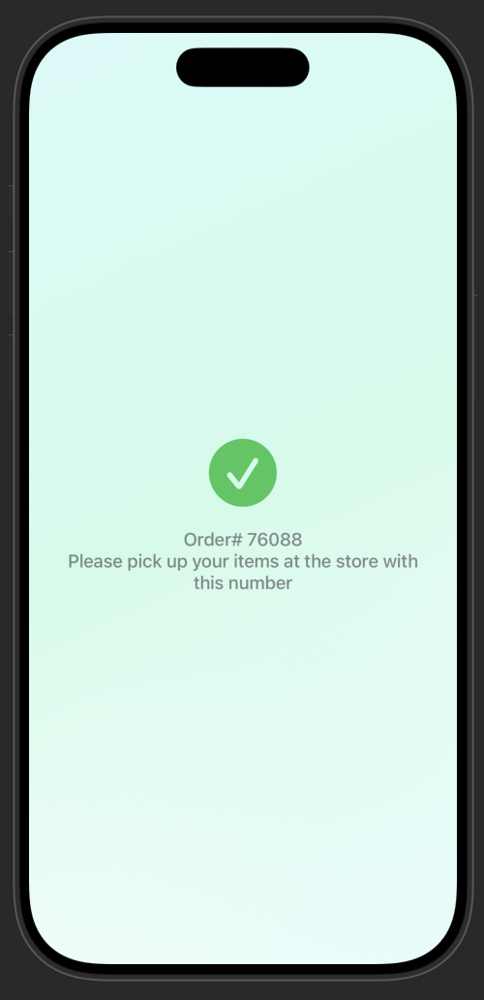

## Team Name: The3musketeers
## Clip Name: CanaLocalShop
## Invocation URL Pattern: canalocal.ca/stores/:id

---

## What Great Looks Like

Your submission is strong when it is:
- **Specific**: one clear fan moment, one clear problem, one clear outcome
- **Clip-shaped**: value in under 30 seconds, no heavy onboarding
- **Business-aware**: connects to revenue (venue, online, or both)
- **Testable**: prototype actually runs in the simulator with your URL pattern

---

### 1. Problem Framing

Which user moment or touchpoint are you targeting?

- [ ] Discovery / first awareness
- [ ] Intent / consideration
- [x] Purchase / conversion
- [ ] In-person / on-site interaction
- [ ] Post-purchase / re-engagement
- [ ] Other: ___

What friction or missed opportunity are you solving for? (3-5 sentences)

Small businesses often struggle to capture the attention of pedestrians who pass by their storefronts but do not take the extra step 
to go inside. Many potential customers may be curious about what a store offers but are unwilling to interrupt their routine or wait in 
line just to browse. This creates a missed opportunity for businesses to convert nearby foot traffic into actual customers. The app 
clip reduces this friction by allowing pedestrians to instantly discover products, browse offerings, and place an order directly from 
their phone without downloading an app. This helps small businesses turn casual passersby into customers in a simple and accessible way.

---

### 2. Proposed Solution

**How is the Clip invoked?** (check all that apply)
- [x] QR Code (printed on physical surface)
- [ ] NFC Tag (embedded in object — wristband, poster, etc.)
- [ ] iMessage / SMS Link
- [ ] Safari Smart App Banner
- [ ] Apple Maps (location-based)
- [ ] Siri Suggestion
- [ ] Other: ___

**End-to-end user experience** (step by step):
1. user scans QR code to access the app clip
2. user selects their desired product for purchasing
3. user pay using Apple Pay and receives an order ID
4. user arrives at store with the order ID to pick up what they bought

**How does the 8-hour notification window factor into your strategy?**

The 8-hour notification window aligns well with the short term nature of my app clip's use case. The app clip is designed for quick, 
in-store purchases and pickups, giving users the reliability and speed of an app but also the frictionless access of a website.

For instance, a father going to work in the morning might pass a local shop, scan the QR code, place an
order while sipping his morning coffee. After his shift, all he wants to do is go home and rest.
Absolutely no energy remaining to go groccery shopping. With our app clip, he can just show up to the shop
on his way home, walk in and get the grocceries he order he bought in the morning, all while supporting
Mrs. Mittens, who runs the corner fruits and veges shop.
---

### 3. Platform Extensions (if applicable)

Does your solution require new Reactiv Clips capabilities that do not exist today? If so, describe them and explain why they are required.

Yes, our extension does require capabilities that do not exisit today. One such requirement is the ability
to remove items from the shopping cart. When the system detects that there are no available stock, the user
should be able to go back and change their order without needing the hassle of reloading the app clip.

---

### 4. Prototype Description

What does your working prototype demonstrate? Which screens/flows are implemented?

Minimum expectation:
- A working `ClipExperience`
- Invokable via your URL pattern in Invocation Console
- At least one complete user flow with a clear end state

---
The working prototype demonstrates a complete app clip shopping and pickup flow designed for quick, in-store purchases without 
requiring a full app download.
The prototype includes a functioning ClipExperience that can be invoked using the configured URL pattern through the Invocation 
Console. Once launched, users can browse a small list of products, add items to their cart, and proceed through a simplified checkout 
process.

The implemented screens include:
* __Product browsing__ where users can view items and add them to their cart
* __Stock verification screen__ that simulates the store confirming item availability
* __Checkout confirmation__ where the order is finalized
* __Order success screen__ displaying a pickup code for the user

The main user flow allows a user to start from the product list, add items to the cart, proceed through a simulated stock verification
process, and receive an order confirmation with a unique pickup code. This provides a clear end state demonstrating the intended App 
Clip experience of quickly placing an order for in-store pickup.

### 5. Impact Hypothesis

How does this create measurable business impact? Be specific about:
- Which channel benefits (in-person, online, or both)?
- What conversion or engagement improvement do you estimate, and why?
- Why this touchpoint is the right place to intervene

This particularly benefits in-person businesses. For someone who would like to shop but just don't have
the time, the user can just scan the QR code that provides them with a catalog of their product as they walk
pass the shop. If they are interested, they can place an order and collect it on their way back. This
supports local businesses and builds a stronger sense of community.
I estimate an increase of around 10% engagement with the business, resulting in a higher chance of sale.

This is the right touchpoint for intervension, since many people walk past these smaller shops
on their way to work/school without knowing what they are selling as they don't have the time to go
in and explore.
---

### Demo Video

Link: https://youtube.com/shorts/6Q4t-1JGeUU?feature=share

### Screenshot(s)

