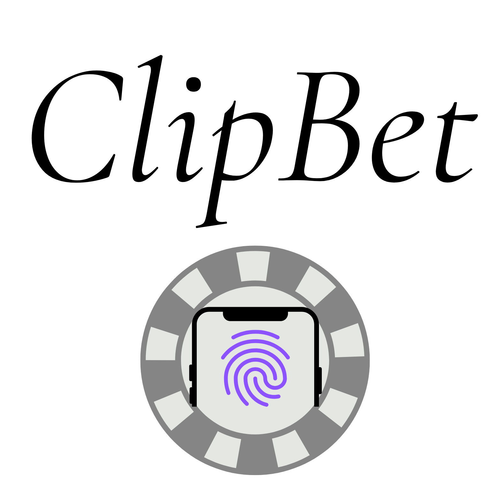
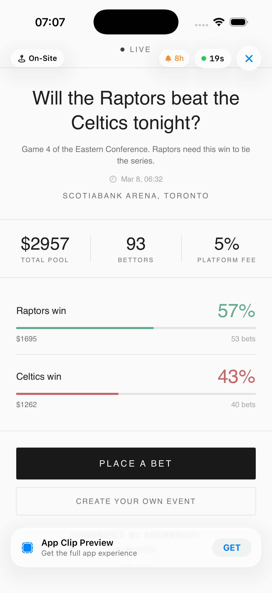
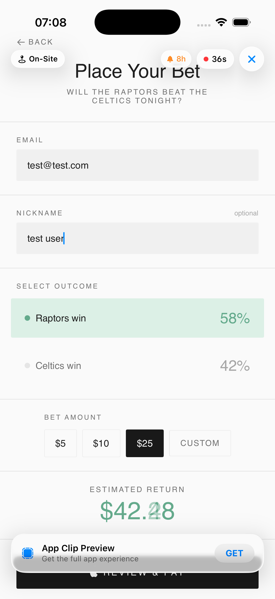
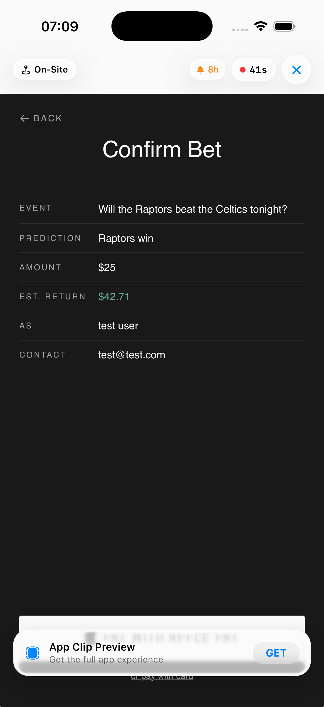
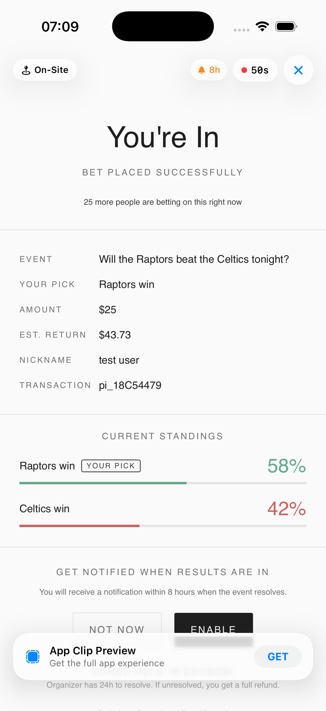
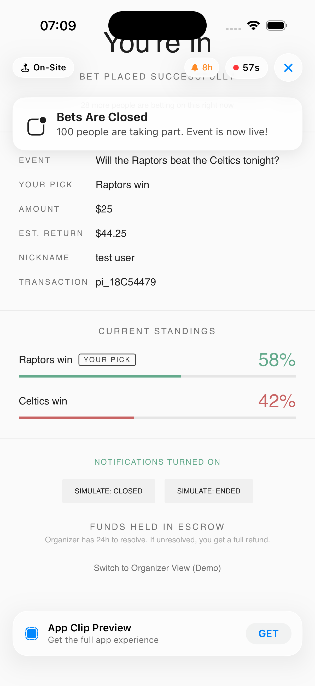
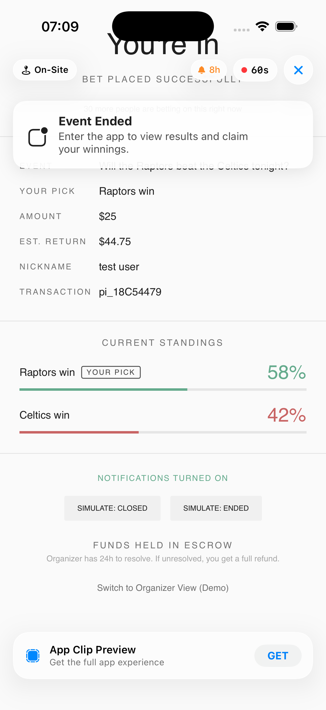

## Team Name: ClipBet
## Clip Name: ClipBet
## Invocation URL Pattern: 
- `clipbet.io/event/:eventId` (opens a specific prediction market for one event)
- Easiest simulator example: `clipbet.io/event/demo`

---

## What Great Looks Like

Your submission is strong when it is:
- **Specific**: one clear fan moment, one clear problem, one clear outcome
- **Clip-shaped**: value in under 30 seconds, no heavy onboarding
- **Business-aware**: connects to revenue (venue, online, or both)
- **Testable**: prototype actually runs in the simulator with your URL pattern

---

### 1. Problem Framing

Which user moment or touchpoint are you targeting?

- [ ] Discovery / first awareness
- [ ] Intent / consideration
- [x] Purchase / conversion
- [x] In-person / on-site interaction
- [x] Post-purchase / re-engagement
- [x] On-site gamification / engagement
- [x] Community / social interaction
- [ ] Other: ___

What friction or missed opportunity are you solving for? (3-5 sentences)

When people are at a bar, game, or concert, there is a lot of energy and strong opinions about what will happen next (overtime, encore, final score, etc.), but there is no simple way to act on those opinions in the moment. Existing prediction products usually require a full app and multi-step onboarding before a wager can be placed, which kills spontaneity. By the time onboarding is done, the key moment often has already passed. Venues and event organizers also have almost no way to turn this in-the-moment hype into direct revenue or to capture fan identity beyond the ticket sale. ClipBet turns this gap into a simple flow: scan a code, place a small prediction in under 30 seconds, and let the venue and platform share in the pool.

> [!IMPORTANT]
> **Primary Focus & Responsibility.** The App Clip is scoped to the bettor experience only (open event, place bet, confirm, done). The prototype also includes an optional quick organizer demo for one short-term, single event in the current session. Organizer onboarding and long-term management happen in the full app/website, where the organizer must authenticate and explicitly agree to Terms of Service before creating or publishing any market.
---

### 2. Proposed Solution

**How is the Clip invoked?** (check all that apply)
- [x] QR Code (printed on physical surface)
- [x] NFC Tag (embedded in object — wristband, poster, etc.)
- [x] iMessage / SMS Link
- [ ] Safari Smart App Banner
- [x] Apple Maps (location-based entry to a specific active event)
- [ ] Siri Suggestion
- [ ] Other: ___

**End-to-end user experience** (step by step):

*(Note: For the demo, we use the App Clip launcher in the Reactiv lab project. In production, this would normally be QR or NFC).*

**A. Bettor (fan) flow**
1. **Launch:** Scan QR (`clipbet.io/event/:eventId`) to view event info, total pool, and active bettors.
2. **Bet:** Tap "Place a Bet", select an outcome, and enter the amount.
3. **Pay:** Check estimated returns and confirm payment with Apple Pay.
4. **Success:** View confirmation and enable result notifications.

**Compliance and regulated flow (production):**
- **Before market publication (organizer side, full app/website):** Organizer authentication, Terms of Service acceptance, and operator verification are completed before a QR/link is issued.
- **At wager attempt (bettor side):** The backend enforces age gate (19+), jurisdiction/geofence eligibility, and user identity checks as required by local regulation.
- **Before payout:** KYC/AML review and transaction monitoring are executed on the backend before any funds are released.
- **App Clip scope:** Primary submission scope is bettor interaction. The optional organizer demo is limited to one short-term, single event in the current session with no persistence. Compliance decisions, identity state, and payout authorization are server-side and outside the Clip lifecycle.

**Organizer handoff:**
Organizer market creation and ongoing dashboard management are handled in the full app/website. The prototype includes a quick organizer demo path for a short-term, single event only. No persistence is used. Multi-event workflows and long-running events require the full app/website.

**How does the 8-hour notification window factor into your strategy?**

We treat the 8‑hour notification window as a way to close the loop on each market, not as a spam channel. When someone places a bet and opts in, they give permission for notifications related *only* to that specific market.

When notifications are turned on, the user will be notified:
- **When Bets Close:** A quick heads up that the market is officially locked, along with a tally of how many people jumped in.
- **When Event Ends (Resolution):** A single focused alert with the final payout results and a link to view the breakdown.

Potential additions to quietly manage the market's lifecycle:
- **Organizer Nudge:** A gentle reminder to the organizer around the 6-hour mark to make sure they resolve things before the window closes.
- **Auto-Resolve/Refunds:** If an organizer completely forgets to settle the bet, the pool is automatically refunded to participants.

- **Limitation:** For events lasting longer than 8 hours (like multi-day LAN tournaments), the notification window acts as a hard constraint for sending resolution alerts.

---

### 3. Platform Extensions (if applicable)

**None required.**

**The solution is fully App Clip compliant:**
- **Bettor Path**: `clipbet.io/event/:eventId` → place bet → done (stateless)

**Architecture and Constraints:**
- **Single Task**: Primary invocation is one bettor action on one event. The organizer demo is a separate optional prototype path for one event in-session.
- **No Persistence**: The Clip is stateless. Session, compliance, KYC/AML, and payout controls are managed by backend services and the full app/website.
- **Short-Lived**: The bettor flow is designed to complete in under 30 seconds, following App Clip intent.
- **Organizer demo limit**: The optional organizer prototype path is limited to one short-term, single event in-session. It does not provide persistent multi-event management.

The implemented Clip flow completes in under 30 seconds with zero stored state.

---

### 4. Prototype Description

What does your working prototype demonstrate? Which screens/flows are implemented?

Minimum expectation:
- A working `ClipExperience`
- Invokable via your URL pattern in Invocation Console
- At least one complete user flow with a clear end state

The prototype demonstrates the bettor App Clip flow running inside the Reactiv ClipKit simulator, with data mocked locally to showcase the interaction and timing.
Current simulator registration is `clipbet.io/event/:eventId`.

**Screens and flows implemented:**
- **Event Landing** (`/event/:eventId`): Dashboard featuring event description, pool stats, and active betting counts.
- **Bettor Flow:** Sequential path through outcome selection, nickname/email input, and native Apple Pay payment sheet.
- **Success & Receipt:** Confirmation screen showing bet details and result notification toggle.
- **Compliance integration point:** Payment confirmation is shown as a client step; real production approval (age, jurisdiction, KYC/AML, payout release) is enforced by backend services.
- **Organizer quick setup (prototype):** One short-term, single-event creation path with event details, preview, and QR generation in the same session.
- **Organizer dashboard (prototype):** Demo view for one event only, with no persistent reopen behavior.
- **Organizer management location (production):** Multi-event management, resolution history, and long-running event operations are handled in the full app/website.

---

### 5. Impact Hypothesis

How does this create measurable business impact? Be specific about:
- Which channel benefits (in-person, online, or both)?
- What conversion or engagement improvement do you estimate, and why?
- Why this touchpoint is the right place to intervene

**Which channel benefits (in-person, online, or both)?**
ClipBet mainly boosts in-person venues like bars, local LAN tournaments (Valorant/CS2), community events, and even hackathons by adding real-time engagement during the event. It also has an online tail through shared links, but the core value is physical spaces where people gather. It turns passive observers into active participants at the exact moment of highest energy.

**What conversion or engagement improvement do you estimate, and why?**
People bet on everything—from pro sports to local chess tournaments, "Hackathon best project," or "Will our bar trivia team take first?" We estimate a **20-30% participation rate** among attendees for small $5-15 bets. This creates $200-500 pools per event, with a platform cut generating immediate revenue.

Having even a tiny amount of money on the line makes people care more and stay longer for the final result. This is a great way to get people outdoors to watch local sports or community events they already love. By turning viewers into active participants, it brings the community closer together and provides organizers with a stable, predictable income for every event they host. It also reflects a practical form of "wisdom of the crowd," where outcomes feel like a shared story the audience helped shape.

**Why this touchpoint is the right place to intervene?**
Live local events are where communities already gather, but they often lack a shared activity that gets everyone involved. Betting on hyperlocal outcomes (neighborhood soccer, LAN gaming matches, chess club tournaments, hackathon winners) turns passive watching into active participation. 

Because App Clips require **no app download**, we remove the #1 barrier to entry. This builds real relationships between venues, organizers, and fans at the exact moment when excitement is highest. It’s not just about the money—it’s about the "you had to be there" experience that makes a community feel tighter, more active, and genuinely engaged.

---

### Demo Video

Link: 
- Google Drive: https://drive.google.com/file/d/1arkTgzk7cXeK3CRYdO5rOis4Jtj7y74J/view?usp=sharing
- YouTube: https://youtu.be/yDGhNRkr158?si=1MTYBVBpnEIokRvg

*(Note: For submission evaluation, the primary App Clip scope is the bettor flow shown in the first part of the video.)*

### Screenshots

**Bettor Flow:**
1. **Event Landing:** The initial view of a specific prediction market.

2. **Betting Flow:**

3. **Payment Confirmation:**

4. **Success:**

5. **Bets Closed:**

6. **Event Ended:**

### Website/Live Demo
Link: https://clipbet-reactiv.vercel.app/
