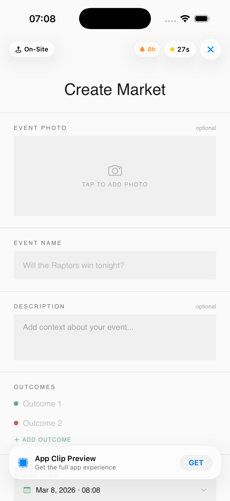
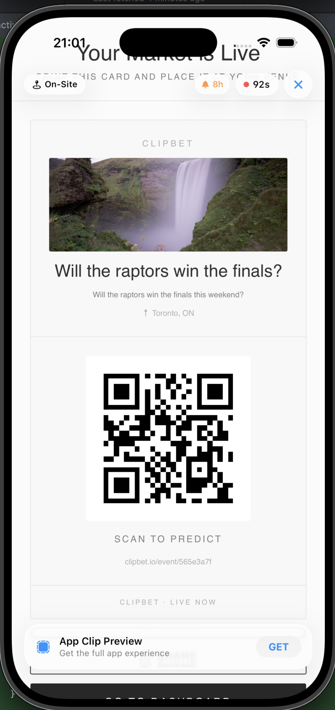

## Team Name: ClipBet
## Clip Name: ClipBet
## Invocation URL Pattern: 
- `clipbet.io/event/:eventId` (opens a specific prediction market for one event)
- `clipbet.io/discover` (opens a generic discovery / create-event entry point)

---

## What Great Looks Like

Your submission is strong when it is:
- **Specific**: one clear fan moment, one clear problem, one clear outcome
- **Clip-shaped**: value in under 30 seconds, no heavy onboarding
- **Business-aware**: connects to revenue (venue, online, or both)
- **Testable**: prototype actually runs in the simulator with your URL pattern

---

### 1. Problem Framing

Which user moment or touchpoint are you targeting?

- [ ] Discovery / first awareness
- [ ] Intent / consideration
- [x] Purchase / conversion
- [x] In-person / on-site interaction
- [x] Post-purchase / re-engagement
- [x] On-site gamification / engagement
- [x] Community / social interaction
- [ ] Other: ___

What friction or missed opportunity are you solving for? (3-5 sentences)

When people are at a bar, game, or concert, there is a lot of energy and strong opinions about what will happen next (overtime, encore, final score, etc.), but there is no simple way to act on those opinions in the moment. Existing prediction markets require downloading a full app, creating an account, and going through identity checks before placing a bet, which kills the spontaneity. By the time someone finishes onboarding, the key moment has usually passed. Venues and event organizers also have almost no way to turn this in-the-moment hype into direct revenue or to capture fan identity beyond the ticket sale. ClipBet turns this gap into a simple flow: scan a code, place a small prediction in under 30 seconds, and let the venue and platform share in the pool.

---

### 2. Proposed Solution

**How is the Clip invoked?** (check all that apply)
- [x] QR Code (printed on physical surface)
- [x] NFC Tag (embedded in object — wristband, poster, etc.)
- [x] iMessage / SMS Link
- [ ] Safari Smart App Banner
- [x] Apple Maps (location-based discovery of nearby active prediction markets)
- [ ] Siri Suggestion
- [ ] Other: ___

**End-to-end user experience** (step by step):

*(Note: For the demo, we use the App Clip launcher in the Reactiv lab project. In production, this would normally be QR or NFC).*

**A. Bettor (fan) flow**
1. **Launch:** Scan QR (`clipbet.io/event/:eventId`) to view event info, total pool, and active bettors.
2. **Bet:** Tap "Place a Bet", select an outcome, and enter the amount.
3. **Pay:** Check estimated returns and confirm payment with Apple Pay.
4. **Success:** View confirmation and enable result notifications.

**B. Organizer (operator) flow**
1. **Launch & Setup:** An organizer launches the Clip via `clipbet.io/discover` (or a "Create your own" QR). They view the current event info, pool, and bettors.
2. **Authenticate & Agree:** The organizer signs in with Apple securely and agrees with the terms of service.
3. **Create Market:** They upload an event photo, provide a name and description, add specific outcomes, and define the event time, location, and minimum bet amount.
4. **Preview & Go Live:** The organizer previews the market and taps to create it.
5. **Share the Market:** A unique QR code is generated and displayed. The organizer can scan it from another device or access core share functionality.
6. **Manage:** Persistent management (pool history, outcome resolution across events) is handled via the **ClipBet Website**, while the Clip provides a one-time view of current market performance for the event just created.

**C. Potential / Discovery flow**
1. A user launches `clipbet.io/discover` and sees "Browse Nearby Events" or "Create Event".
2. Tapping a market takes them directly into the Bettor flow for that specific event.

**How does the 8-hour notification window factor into your strategy?**

We treat the 8‑hour notification window as a way to close the loop on each market, not as a spam channel. When someone places a bet and opts in, they give permission for notifications related *only* to that specific market.

When notifications are turned on, the user will be notified:
- **When Bets Close:** A quick heads up that the market is officially locked, along with a tally of how many people jumped in.
- **When Event Ends (Resolution):** A single focused alert with the final payout results and a link to view the breakdown.

Potential additions to quietly manage the market's lifecycle:
- **Organizer Nudge:** A gentle reminder to the organizer around the 6-hour mark to make sure they resolve things before the window closes.
- **Auto-Resolve/Refunds:** If an organizer completely forgets to settle the bet, the pool is automatically refunded to participants.

- **Limitation:** For events lasting longer than 8 hours (like multi-day LAN tournaments), the notification window acts as a hard constraint for sending resolution alerts.

---

### 3. Platform Extensions (if applicable)

**None required.**

**Current flows are App Clip compliant:**
- **Bettor**: `clipbet.io/event/:eventId` → place bet → done (stateless)
- **Quick organizer**: `clipbet.io/discover` → generate QR → done (stateless)

**No persistence needed:**
- Organizers pre-register on website (19+, compliance)
- Each Clip launch = fresh, independent task
- No local tokens, no dashboard reopening, no identity checks in Clip
- Resolution/management happens on website (`clipbet.io/my-markets` as  example)

**Dedicated URLs = Separate Tasks:**
- `/event/:eventId` is for bettors to interact with a specific market.
- `/discover` is for organizers to quickly generate new market QRs.

Both flows complete in under 30 seconds with zero stored state.

---

### 4. Prototype Description

What does your working prototype demonstrate? Which screens/flows are implemented?

Minimum expectation:
- A working `ClipExperience`
- Invokable via your URL pattern in Invocation Console
- At least one complete user flow with a clear end state

The prototype demonstrates both bettor and organizer flows running inside the Reactiv ClipKit simulator, with all data mocked locally to showcase the complete user experience.

**Screens and flows implemented:**
- **Discovery** (`/discover`): Entry point for organizers to view active nearby markets or start the creation flow.
- **Event Landing** (`/event/:eventId`): Dashboard featuring event description, pool stats, and active betting counts.
- **Bettor Flow:** Sequential path through outcome selection, nickname/email input, and native Apple Pay payment sheet.
- **Success & Receipt:** Confirmation screen showing bet details and result notification toggle.
- **Organizer Setup (Creation):** Creation flow featuring **Sign In with Apple**, TOS agreement, and market metadata entry (question, outcomes, and event photo).
- **Market Preview:** UI rendering of the market, allowing organizers to verify event details before generating the live QR.
- **Organizer Dashboard (Demo):** Dashboard view showing live entry counts, platform fees, and resolution controls.

---

### 5. Impact Hypothesis

How does this create measurable business impact? Be specific about:
- Which channel benefits (in-person, online, or both)?
- What conversion or engagement improvement do you estimate, and why?
- Why this touchpoint is the right place to intervene

**Which channel benefits (in-person, online, or both)?**
ClipBet mainly boosts in-person venues like bars, local LAN tournaments (Valorant/CS2), community events, and even hackathons by adding real-time engagement during the event. It also has an online tail through shared links, but the core value is physical spaces where people gather. It turns passive observers into active participants at the exact moment of highest energy.

**What conversion or engagement improvement do you estimate, and why?**
People bet on everything—from pro sports to local chess tournaments, "Hackathon best project," or "Will our bar trivia team take first?" We estimate a **20-30% participation rate** among attendees for small $5-15 bets. This creates $200-500 pools per event, with a platform cut generating immediate revenue.

Having even a tiny amount of money on the line makes people care more and stay longer for the final result. This is a great way to get people outdoors to watch local sports or community events they already love. By turning viewers into active participants, it brings the community closer together and provides organizers with a stable, predictable income for every event they host. Plus, it kinda symbolizes  the "wisdom of the crowd," making the results feel like a shared story everyone helped write. 

**Why this touchpoint is the right place to intervene?**
Live local events are where communities already gather, but they often lack a shared activity that gets everyone involved. Betting on hyperlocal outcomes (neighborhood soccer, LAN gaming matches, chess club tournaments, hackathon winners) turns passive watching into active participation. 

Because App Clips require **no app download**, we remove the #1 barrier to entry. This builds real relationships between venues, organizers, and fans at the exact moment when excitement is highest. It’s not just about the money—it’s about the "you had to be there" experience that makes a community feel tighter, more active, and genuinely engaged.

---

### Demo Video

Link: 
- Google Drive: https://drive.google.com/file/d/1arkTgzk7cXeK3CRYdO5rOis4Jtj7y74J/view?usp=sharing
- YouTube: https://youtu.be/yDGhNRkr158?si=1MTYBVBpnEIokRvg

*(Note: Based on the requirements, you can treat the first 30 seconds of the video, which outlines the user (bettor) flow, as the main part of the submission. The remainder of the video demonstrates the ephemeral operator flow.)*

### Screenshots

**Bettor Flow:**
1. **Event Landing (Start for both Organizer and Bettor):** The initial view of a specific prediction market.

2. **Betting Flow:**

3. **Payment Confirmation:**

4. **Success:**

5. **Bets Closed:**

6. **Event Ended:**

**Organizer Flow:**
1. **Creating Event:**

2. **Viewing the Event:**

### Website/Live Demo
Link: https://clipbet-reactiv.vercel.app/
