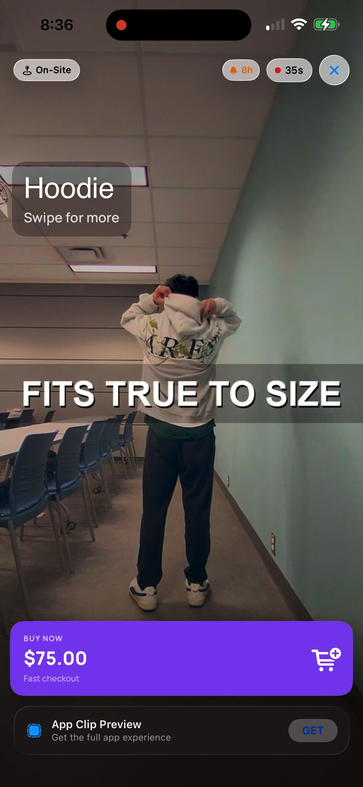
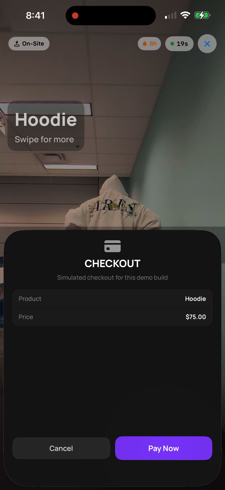
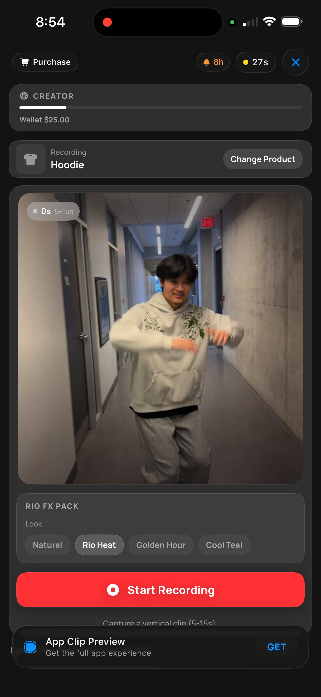
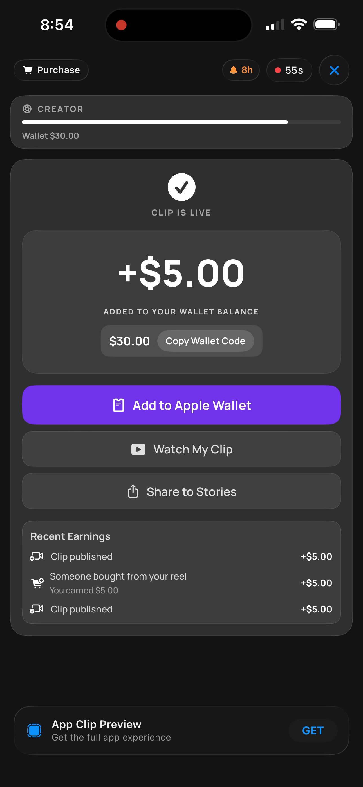
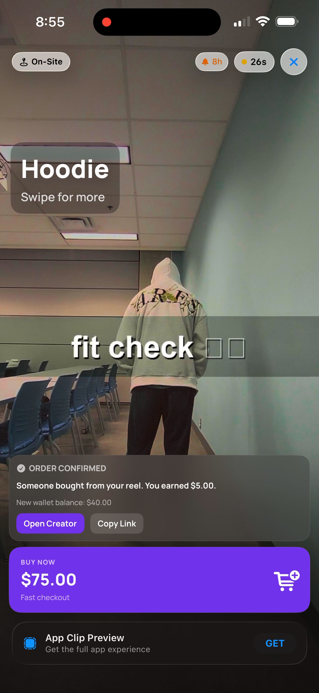
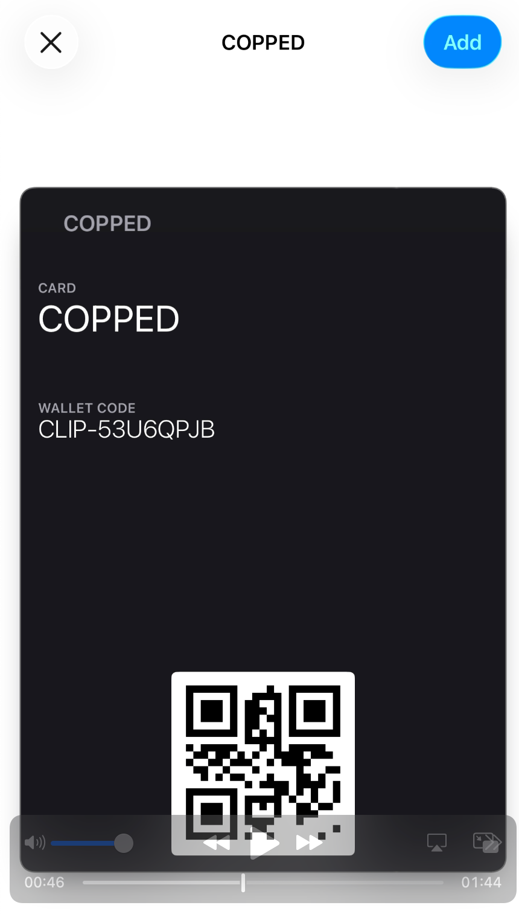
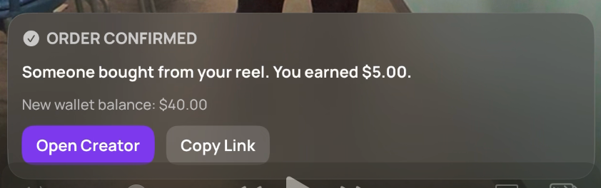

## Team Name: Copped
## Clip Name: Copped Viewer + Copped Creator
## Invocation URL Pattern: clip.copped.app/v/:productId and clip.copped.app/c/:receiptId (optional `?store=<domain>` for public Shopify catalog)

---

## What Great Looks Like

Copped turns in-store shoppers into high-intent creators with immediate upside:
- Viewer Clip: scan product QR, watch social-proof clips, buy fast
- Creator Clip: scan receipt QR, record 5-15s clip, get instant $5 reward
- Bonus loop: if clip converts within the 8-hour window, creator gets +$5

---

### 1. Problem Framing

Which user moment or touchpoint are you targeting?

- [ ] Discovery / first awareness
- [x] Intent / consideration
- [x] Purchase / conversion
- [x] In-person / on-site interaction
- [x] Post-purchase / re-engagement
- [ ] Other: ___

In physical retail, shoppers still trust other customers more than polished ads, but merchants struggle to capture fresh UGC at the moment of purchase intent. Traditional UGC asks creators to do extra work later with weak incentives. Copped solves this by attaching creation directly to the receipt moment and rewarding instantly. The model is simple: make a clip now, earn $5 now, and earn $5 more if your clip actually converts. This aligns creator effort with merchant outcomes while staying App Clip-native and no-account.

---

### 2. Proposed Solution

**How is the Clip invoked?** (check all that apply)
- [x] QR Code (printed on physical surface)
- [x] NFC Tag (embedded in object — wristband, poster, etc.)
- [x] iMessage / SMS Link
- [x] Safari Smart App Banner
- [x] Apple Maps (location-based)
- [x] Siri Suggestion
- [ ] Other: ___

Note: In this simulator prototype, invocation is tested via URL input and an in-app NFC payload simulator button in the invocation console (no NFC entitlement required), while the trigger mapping above represents real App Clip deployment options.
Catalog note: pass `?store=<domain>` to load products from public Shopify `products.json` without authentication.
NFC demo note (free developer setup): the invocation console NFC button accepts either a full URL payload (`clip.copped.app/v/hoodie`) or a raw product ID payload (`hoodie`), both mapped to the viewer clip.

**End-to-end user experience** (step by step):
1. Shopper scans product trigger (`clip.copped.app/v/hoodie`) and watches ranked buyer clips.
2. Shopper buys from the viewer flow; conversion is logged and a receipt record is generated.
3. Buyer scans receipt trigger (`clip.copped.app/c/order_1234`), records a 5-15s clip, passes on-device validation, optionally adds text, and stakes clip for instant $5 coupon.
4. If any viewer purchase converts from that clip within 8 hours, creator becomes bonus-eligible (+$5).

**How does the 8-hour notification window factor into your strategy?**

Copped uses the App Clip 8-hour window as a conversion reward channel. Instant reward removes dead-ends, while bonus reward uses the short-lifetime push window to reinforce behavior and close the loop between creator effort and merchant revenue.

---

### 3. Platform Extensions (if applicable)

No hard platform extensions are required for this prototype. Production rollout would add:
- Real Shopify discount generation and redemption tracking
- Real APNs delivery for bonus notifications
- Signed Apple Wallet pass generation

Submission scope note: some implementation-support edits were made outside `Submissions/copped/` (for simulator/runtime wiring and permissions). This is organizer-approved per [Reactiv] Mike P on Discord (March 7, 2026): "Changing the lab project permissions is allowed if needed for your project."

---

### 4. Prototype Description

This prototype includes two runnable `ClipExperience` flows in the simulator:

- `CoppedViewerExperience`
  - URL routing via `clip.copped.app/v/:productId`
  - Public Shopify catalog integration via unauthenticated `products.json` (with fallback)
  - Clip feed sorted by conversions then recency
  - Mock checkout that logs conversion and produces creator receipt URL

- `CoppedCreatorExperience`
  - URL routing via `clip.copped.app/c/:receiptId`
  - Same public Shopify catalog source used for product resolution (no auth)
  - Receipt anti-fraud guard (one clip per receipt)
  - Product selection from receipt-only product list
  - Real camera capture on device with simulator fallback mode
  - 5-15 second enforcement
  - On-device AI validation fallback path
  - Optional text overlay + compositing attempt
  - Instant coupon success UX + wallet/share fallback actions

All backend logic is represented by a local in-memory actor (`CoppedMockBackend`) that mirrors planned endpoint behavior.

MomentTimer validation: we verified the first meaningful value moment appears under 30 seconds for both tracks (viewer: immediate social proof + buy CTA; creator: record flow + reward confirmation).

---

### 5. Impact Hypothesis

- Channel impact: both in-person and online, with strongest lift at in-store intent moments.
- Expected improvements:
  - Higher conversion confidence from authentic customer clips at shelf-side decision time
  - More UGC throughput from instant + performance-based creator rewards
  - Better re-engagement probability via 8-hour bonus reminder window
- Why this touchpoint:
  - Receipt moment has guaranteed buyer authenticity
  - Product scan moment has highest immediate purchase intent
  - App Clip friction profile (no install, no login) fits both moments perfectly

---

### Demo Video

Google Drive folder (all demo videos): https://drive.google.com/drive/folders/1iDUOn7rRy_Gpmyru26CI3nVl9M779oHy?usp=sharing

Optional direct video links:
- Viewer demo (hoodie): https://drive.google.com/file/d/1CmHS6nuLgIhEnxWaSevPkExCi2J1yC9U/view?usp=sharing
- Viewer demo (book): Included in the Google Drive folder above.
- Creator demo (record -> reward): Included in the Google Drive folder above.

### Screenshot(s)

Screenshot 1 - Viewer landing (`/v/hoodie`)

Screenshot 2 - Viewer checkout sheet

Screenshot 3 - Creator recording (`/c/demo?product=hoodie`)

Screenshot 4 - Creator success (+$5 instant reward)

Screenshot 5 - Conversion proof ("Someone bought from your reel")

Bonus screenshot - Apple Wallet pass add sheet (from attached screenshot set)

Bonus screenshot - conversion banner close-up (from attached screenshot set)

