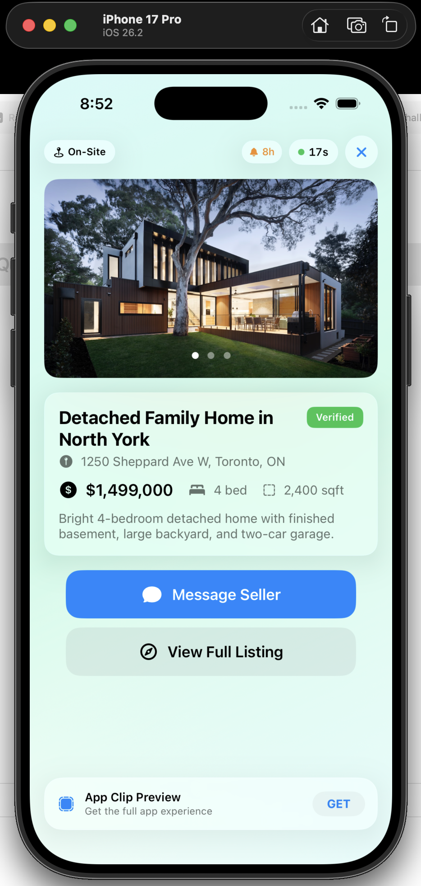
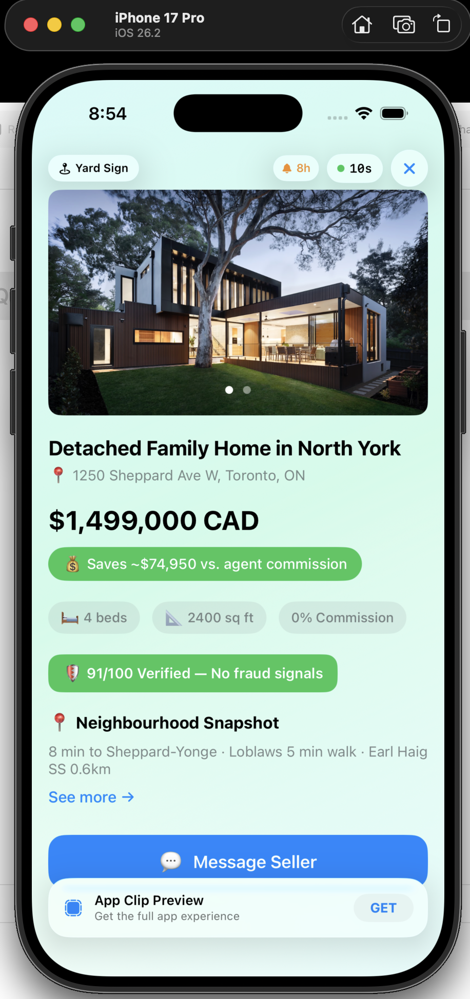

## Team Name: DeedScan

## Clip experiences (two)

This submission includes two DeedScan App Clip experiences:

- **DeedScanListingExperience** — Hardcoded demo listing; no API.  
  **URL pattern:** `deedscan.app/clip` (optional query: `deedscan.app/clip?id=demo_listing_001`).

- **DeedScanClipExperience** — API-backed listing; fetches from backend.  
  **URL pattern:** `deedscan.app/clip/:id` (e.g. `deedscan.app/clip/demo_listing_001`).  
  For lab compatibility, the clip also accepts `deedscan.app/clip/42` (id `42` is mapped to `demo_listing_001` for the API call).

---

## What Great Looks Like

Your submission is strong when it is:
- **Specific**: one clear fan moment, one clear problem, one clear outcome
- **Clip-shaped**: value in under 30 seconds, no heavy onboarding
- **Business-aware**: connects to revenue (venue, online, or both)
- **Testable**: prototype actually runs in the simulator with your URL pattern

---

### 1. Problem Framing

**Problem:** Buyers walk past for-sale signs and end up on sites built around 5% commissions. With DeedScan: scan → instant listing + neighbourhood snapshot + direct seller contact. Zero friction.

---

### 2. Proposed Solution

**Invocation:** Physical QR code on a yard sign encodes `deedscan.app/clip?id=demo_listing_001`

**Core action:** View listing + neighbourhood info → tap Message Seller. Under 20 seconds.

**Why a Clip not an app:** Purely ephemeral lookup — people won't install an app to view one listing they passed on the street.

---

### 3. Platform Extensions (if applicable)

None required. The Clip uses hardcoded demo data and deep-links into the web app for messaging (localhost:3000 for local Auth0).

---

### 4. Prototype Description

**What does your working prototype demonstrate?**

- **DeedScanListingExperience (Yard Sign tab):** Hardcoded demo — no API. Tap card or enter `deedscan.app/clip`. Message Seller opens localhost:3000.
- **DeedScanClipExperience (On-Site tab):** API-backed. Tap "DeedScan Property View" card or enter `deedscan.app/clip/demo_listing_001` (or `deedscan.app/clip/42`; the clip maps `42` → `demo_listing_001` so it works with the lab default sample URL). Requires backend at `http://localhost:3000` with `GET /api/listings/demo_listing_001`.
- **Landing:** Photo carousel, property detail, confidence badge, Message Seller / View Full Listing, optional "More nearby".

---

### 5. Impact Hypothesis

**Impact:** Removes the real estate agent as gatekeeper at the very first touchpoint in the transaction.

---

### Demo Video

**Required for PR acceptance.** Add a link to a short screen recording that shows:
- Tap card (or enter URL) → property loads
- Message Seller and/or Neighbourhood sheet

Upload the video (e.g. Google Drive, Loom, YouTube unlisted, or GitHub), then replace the placeholder below with the actual URL.

**Link:** ___ *(add URL when ready)*

### Screenshot(s)

**Required for PR acceptance.** Screenshots are stored in `Submissions/deedscan/screenshots/` and embedded below. Add more as you complete features.

| Experience | Description |
|------------|-------------|
| **On-Site (API-backed)** | Property detail, Verified badge, Message Seller / View Full Listing |
| **Yard Sign (hardcoded)** | Price, savings pill, specs, AI badge, Neighbourhood Snapshot, Message Seller |

#### Property view — On-Site clip (DeedScanClipExperience)

#### Property view — Yard Sign clip (DeedScanListingExperience)

*(Optional: add more screenshots for AI badge close-up, Neighbourhood "See more" sheet, or Message Seller CTA and link them here.)*
