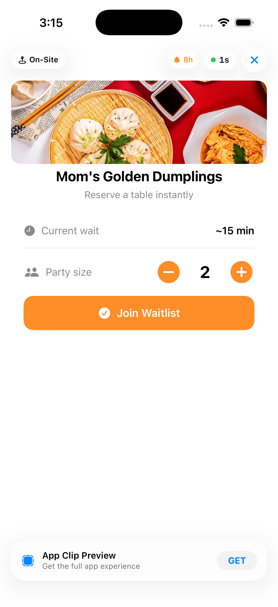
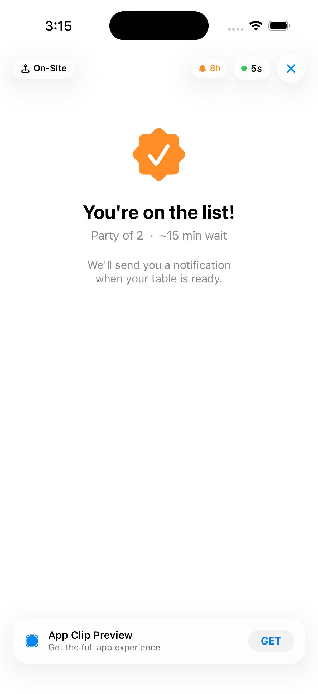
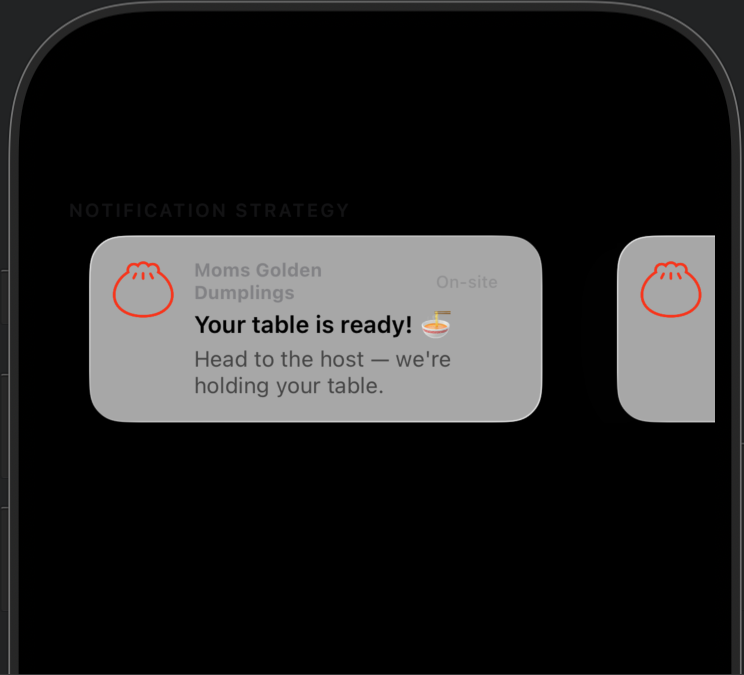
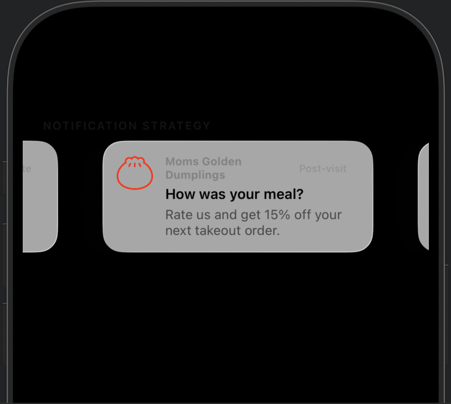
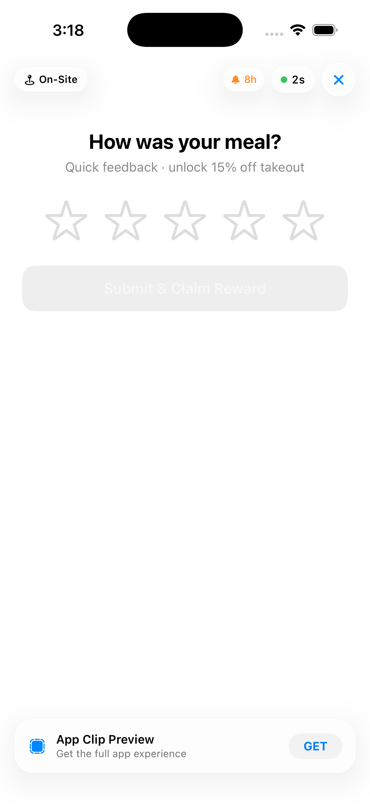
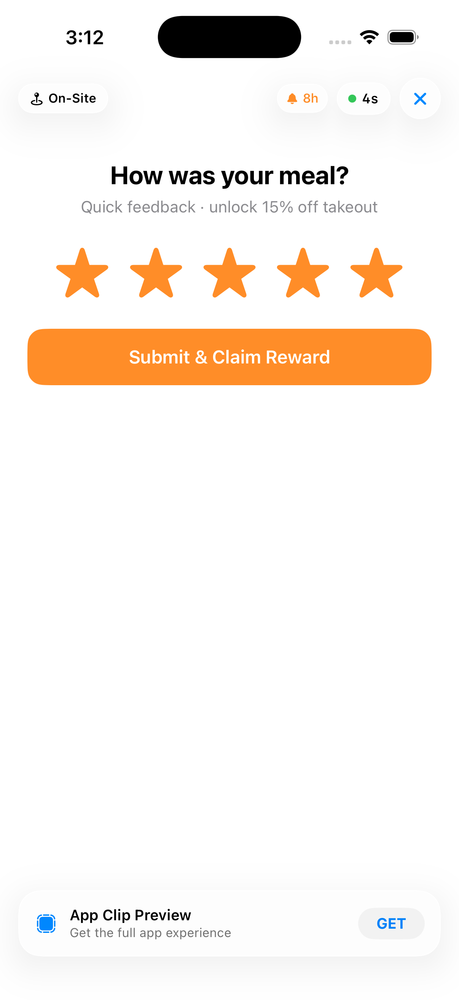
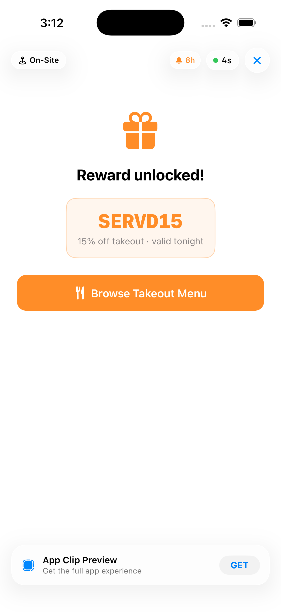
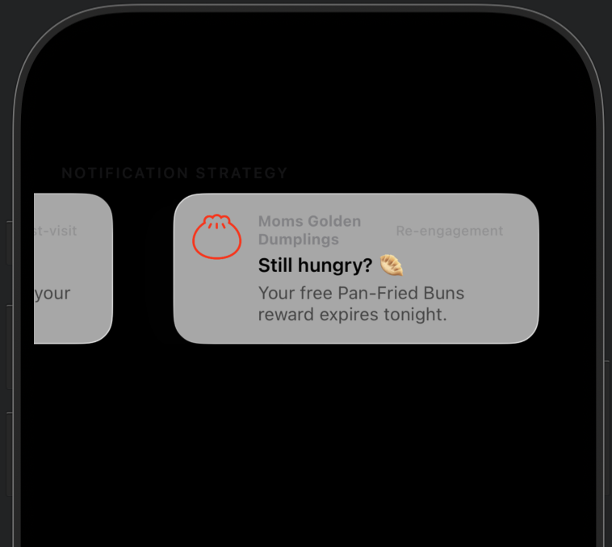
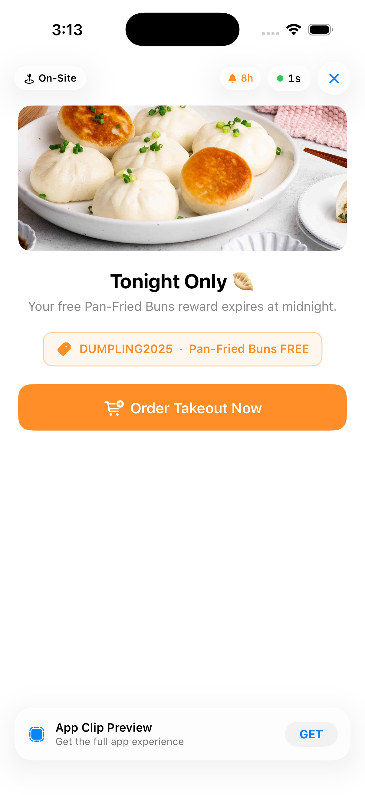
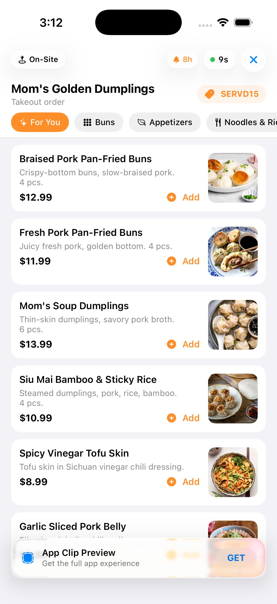

## Team Name: Team Kiizon
## Clip Name: Servd
## Invocation URL Pattern: `momsgoldendumplings.com/reserve/:flow`

---

## What Great Looks Like

Your submission is strong when it is:
- **Specific**: one clear fan moment, one clear problem, one clear outcome
- **Clip-shaped**: value in under 30 seconds, no heavy onboarding
- **Business-aware**: connects to revenue (venue, online, or both)
- **Testable**: prototype actually runs in the simulator with your URL pattern

---

### 1. Problem Framing

Which user moment or touchpoint are you targeting?

- [ ] Discovery / first awareness
- [ ] Intent / consideration
- [ ] Purchase / conversion
- [X] In-person / on-site interaction
- [X] Post-purchase / re-engagement
- [ ] Other: ___

What friction or missed opportunity are you solving for? (3-5 sentences)

Restaurants have no direct channel to re-engage guests after a visit. Third-party delivery platforms like Uber Eats and DoorDash own that re-engagement layer and charge 20–30% commission for every order that flows through it. When a guest leaves without an app install, the restaurant loses them entirely: no feedback, no loyalty, no takeout conversion. Servd turns a simple waitlist scan into an owned re-engagement channel. The reservation is not the product; it is the trigger that opens the 8-hour App Clip notification window, giving the restaurant three high-intent touchpoints with the guest before the evening ends.

### 2. Proposed Solution

**How is the Clip invoked?** (check all that apply)
- [X] QR Code (printed on physical surface — at venue entrance or host stand)
- [X] NFC Tag (embedded at host stand)
- [ ] iMessage / SMS Link
- [ ] Safari Smart App Banner
- [ ] Apple Maps (location-based)
- [ ] Siri Suggestion
- [ ] Other: ___

**End-to-end user experience** (step by step):

1. Guest scans a QR code at the restaurant entrance or host stand.
2. The Servd App Clip opens instantly — no download, no account, no onboarding.
3. Guest selects their party size and taps **Join Waitlist** (under 10 seconds).
4. Confirmation screen: "You're on the list — we'll notify you when your table is ready."
5. _(~15–30 min)_ Push notification: **"Your table is ready! Head to the host."**
6. _(~2 hours)_ Push notification: **"How was your meal? Rate us and get 15% off takeout."** — opens `/reserve/feedback` in the Clip.
7. Guest rates their experience and claims a `SERVD15` discount code.
8. _(~6 hours)_ Push notification: **"Still hungry? Your free Pan-Fried Buns reward expires tonight."** — opens `/reserve/offer` in the Clip.
9. Guest taps **Order Takeout Now** and applies `DUMPLING2025` for a free item — one-time diner becomes a repeat customer.

**How does the 8-hour notification window factor into your strategy?**

The waitlist join is the sole purpose of the Clip interaction as it happens in under 30 seconds and requires no login. Its real value is that it opens the App Clip 8-hour notification window. We use all three notification slots deliberately:

1. Alert user that their table reservation is ready.
2. After ~2 hours, capture sentiment and issues, offering discount code for completion.
3. After ~6 hours, convert diner to repeat takeout customer by offering limited-time promotions.

The restaurant sends these notifications without the guest ever granting explicit permission — that is the core Reactiv Clips value proposition.

### 3. Platform Extensions (if applicable)

No new Reactiv Clips capabilities required. The solution uses the existing 8-hour notification window as-is. In a production deployment, the restaurant POS system would trigger the "table ready" notification when the table is assigned, and the Reactiv platform would schedule notifications 2 and 3 relative to clip invocation time.

---

### 4. Prototype Description

The working prototype demonstrates three complete flows, each invokable via the Invocation Console:

`momsgoldendumplings.com/reserve/waitlist`: Party-size selector -> Join Waitlist -> Confirmation 
`momsgoldendumplings.com/reserve/feedback`: Star rating -> Submit -> SERVD15 reward code 
`momsgoldendumplings.com/reserve/offer`: Pan-Fried Buns promo -> Order Takeout Now 

All three flows are implemented as lightweight, single-screen SwiftUI views with no navigation stack, no login, and no persistent state.

Both momsgoldendumplings.com/reserve/feedback and momsgoldendumplings.com/reserve/offer should direct to app menu however it is implemented here for the demo.

### 5. Impact Hypothesis

**Channel:** In-person dining -> owned takeout re-engagement (bypasses third-party platforms)

**Conversion estimate:** If 30% of guests scan the QR code and 20% of those respond to the evening takeout notification, a restaurant doing 100 covers/night captures ~6 incremental direct takeout orders per day - at zero commission, compared to 20-30% commission fees on delivery platforms.

**Why this touchpoint:** The moment a guest joins a waitlist is the highest-intent, lowest-friction moment to capture a notification window. The guest is already present, already engaged, and already waiting, the ask (party size + one tap) is trivially small. No other touchpoint offers this combination of physical presence, clear task, and high trust.

### Demo Video

Link: https://youtube.com/shorts/T4hEG8byY54?feature=share

### Screenshot(s)

**Flow 1 — Join Waitlist**

**Flow 2 — Waitlist Confirmed**

**Notification 1 — Table Ready (~15–20 min)**

**Notification 2 — How Was Your Meal? (~2h)**

**Flow 3 — Feedback Screen (empty)**

**Flow 3 — Feedback Screen (submitted)**

**Flow 3 — Reward Unlocked (SERVD15)**

**Notification 3 — Still Hungry? (~6h)**

**Flow 4 — Tonight's Offer (DUMPLING2025)**

**Flow 4 — Takeout Menu (SERVD15 active)**

